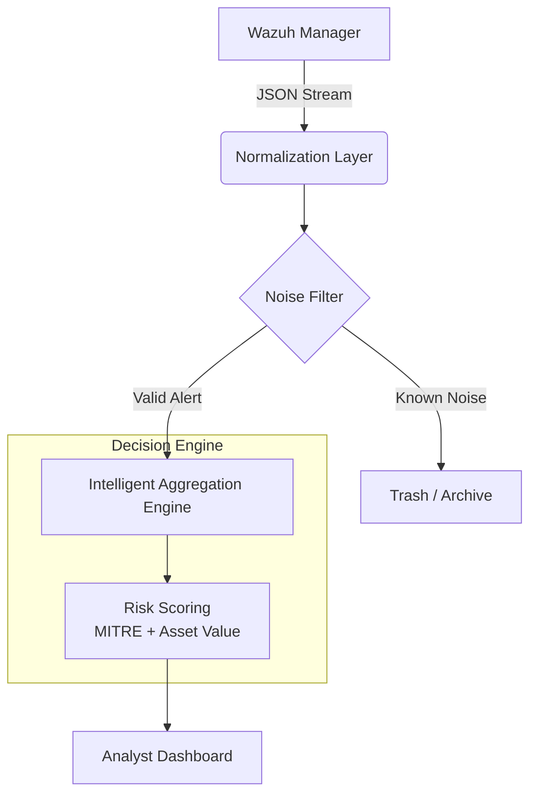

# 🦅 SOC Alert Noise Killer

> **"Stop chasing false positives. Start hunting threats."**

[](https://opensource.org/licenses/MIT)
[](https://github.com/saichandram-sadhu/SOC-Alert-Noise-Killer)
[](https://wazuh.com)
[](https://nodejs.org)
[](https://reactjs.org)

**SOC Alert Noise Killer** is a specialized decision-support tool designed for **L1/L2 SOC Analysts**. It sits between your SIEM (Wazuh) and your dashboard, aggressively filtering noise, aggregating related alerts, and providing **context-aware risk scoring**.

Instead of flooding analysts with 1,000 "SSH Failed" logs, it presents **1 Incident** with a clear narrative:
> *"High-frequency authentication failure (200 attempts) on Critical Asset `db-prod-01`. Impact if ignored: Potential Brute Force Success."*

---

## 🚀 Why This Exists? ( The Problem )

Modern SIEMs are good at logging but bad at **triage**.
*   **Alert Fatigue**: Analysts ignore meaningful alerts because they are buried in noise.
*   **Context Switching**: Jumping between Kibana, Threat Intel, and spreadsheets kills efficiency.
*   **Lack of Priority**: "Which of these 50 alerts should I look at first?"

**This tool fixes that.**

---

## 🧠 Core Architecture



### Key Features

| Feature | Description | Value |
| :--- | :--- | :--- |
| **🛡️ Intelligent Aggregation** | Group 1,000 identical logs into 1 coherent incident. | Reduces volume by **95%+**. |
| **📊 Context-Aware Risk Scoring** | Scores threats based on **MITRE T-Codes** + **Asset Criticality**. | Prioritizes *real* risks over generic scans. |
| **🤖 Automated Analysis** | Heuristic engine analyzes patterns (e.g., "SSH Brute Force"). | Provides L1 analysts with a "Second Opinion". |
| **🔮 "Impact If Ignored"** | Predicts the business consequence of ignoring an alert. | Helps analysts understand *why* they need to act. |

---

## 🛠️ Installation & Setup

### Prerequisites
*   Node.js (v18+)
*   Wazuh Manager (Optional for simulation mod)

### 1. Clone the Repository
```bash
git clone https://github.com/saichandram-sadhu/SOC-Alert-Noise-Killer.git
cd SOC-Alert-Noise-Killer
```

### 2. Install Dependencies
**One-Click Setup**:
Run the included setup script to install dependencies for both Client, Server and Simulator.
```bash
# Windows
npm install && cd client && npm install && cd ../server && npm install && cd ../simulator && npm install
```

### 3. Run Development Mode
To see the tool in action with the **Attack Simulator**:
```bash
start-dev.bat
```
This will launch:
1.  **Backend API** (Port 5000)
2.  **Frontend Dashboard** (Port 5173)
3.  **Attack Simulator** (Sends 50 genuine-looking attack payloads)

---

## 📸 Screenshots

### 1. The Command Center
*A clean, distraction-free feed sorted by **Risk Bucket**.*


### 2. Decision Support Panel
*Every incident explains ITSELF. No more guessing.*


---

## 🧩 How It Works (The Logic)

### Risk Scoring Formula
The engine doesn't just look at "Severity". It calculates risk dynamically:
```javascript
Risk Score = (Wazuh Level * 6) 
             + (Critical MITRE T-Code ? 20 : 0) 
             + (Is Server ? 15 : 5)
```
*   **Example**: A "Level 5" scan on a **Workstation** = `Score 35` (Medium)
*   **Example**: A "Level 5" scan on a **Production DB** = `Score 45` (High)

---

## 🔮 Roadmap
*   [ ] **PostgreSQL Integration**: Move from file-based persistence to enterprise DB.
*   [ ] **LLM Integration**: Replace Heuristic Engine with Local Llama3 for analysis.
*   [ ] **Active Response**: Trigger Wazuh blocks directly from the UI.

---

## 🤝 Contributing
1.  Fork the Project
2.  Create your Feature Branch (`git checkout -b feature/AmazingFeature`)
3.  Commit your Changes (`git commit -m 'Add some AmazingFeature'`)
4.  Push to the Branch (`git push origin feature/AmazingFeature`)
5.  Open a Pull Request

---

### 👨‍💻 Author
**Saichandram Sadhu**
*Cybersecurity Analyst & Full Stack Developer*

---
*Built with ❤️ for Blue Teams everywhere.*
